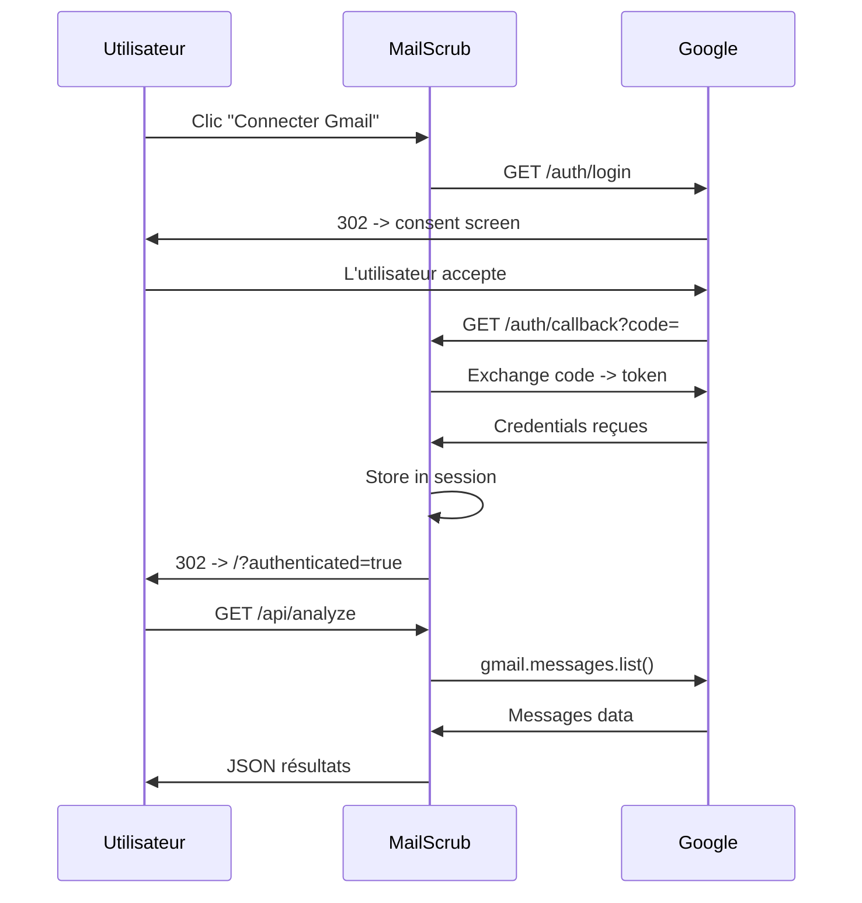

# 🧹 MailScrub.app (v1.0.0 Officielle)

> **Diagnostic de santé pour votre boîte mail — Libérez votre inbox en 2 minutes.**

[](https://mailscrub.app)
[](https://console.cloud.google.com/run?project=mailscrub-app)

---

## 🎯 Qu'est-ce que MailScrub ?

> [!NOTE]
> **Statut du Projet (Février 2026)** : Sortie de la V1 Officielle ! La landing page a été refondue avec un look premium, incluant les avatars Google, la sélection des limites de scan (jusqu'à 5000), le traitement par lots API, et le désabonnement en un clic depuis les fenêtres détaillées. Le projet est configuré pour un déploiement Cloud Run.

MailScrub analyse votre boîte Gmail en quelques secondes et vous donne :

- Un **score de santé mail** (0-100)
- La **répartition** de vos emails (spam, newsletters, notifications, humains)
- Le **top des expéditeurs** les plus fréquents
- Des **recommandations** pour nettoyer votre inbox

### 🌐 URLs

- **Production** : <https://mailscrub.app>
- **Cloud Run** : <https://mailscrub-dashboard-722234333703.europe-west1.run.app>
- **GitHub** : <https://github.com/Noureddine-Hci/mailscrub-app>

---

### 🏗️ Architecture

> 📘 **Voir le guide technique détaillé : [ARCHITECTURE.md](./ARCHITECTURE.md)**

```text
MailScrub/
├── backend/                    # FastAPI (Python 3.12)
│   ├── main.py                 # Point d'entrée — FastAPI app, middlewares, static files
│   ├── .env                    # Variables d'env (NON commité — voir .env.example)
│   ├── requirements.txt        # Dépendances Python
│   ├── routers/
│   │   ├── auth.py             # OAuth 2.0 Google — login, callback, session
│   │   └── analysis.py         # API /api/analyze — lance l'analyse Gmail ou démo
│   └── src/
│       └── services/
│           └── analyzer.py     # Logique d'analyse — catégorisation, score, heuristiques
├── frontend/                   # HTML/CSS/JS (vanilla, pas de framework)
│   ├── index.html              # Page unique — landing + dashboard
│   ├── css/
│   │   └── style.css           # Design premium dark mode + glassmorphism
│   └── js/
│       └── app.js              # Logique frontend — OAuth flow, charts, animations
├── Dockerfile                  # Container image pour Cloud Run
├── .gitignore                  # Exclut .env, .venv, __pycache__, etc.
└── README.md                   # Ce fichier
```

### Stack technique

| Composant | Technologie |
| :--- | :--- |
| Backend | Python 3.12, FastAPI 0.104+ |
| Frontend | HTML5, CSS3 (glassmorphism), JavaScript ES6 |
| Auth | Google OAuth 2.0 (`google-auth-oauthlib`) |
| API | Gmail API v1 (`google-api-python-client`) |
| Session | Starlette SessionMiddleware + itsdangerous |
| Hébergement | Google Cloud Run (europe-west1) |
| Container | Docker (python:3.12-slim) |
| Domaine | mailscrub.app (Netim) → Cloud Run domain mapping |
| CI/CD | gcloud run deploy --source . |

---

## 🚀 Installation locale

### Prérequis

- Python 3.12+
- Un projet Google Cloud avec Gmail API activée
- Des credentials OAuth 2.0 (client ID + secret)

### 1. Cloner le repo

```bash
git clone https://github.com/Noureddine-Hci/mailscrub-app.git
cd mailscrub-app
```

### 2. Environnement virtuel

```bash
python -m venv .venv
# Windows:
.venv\Scripts\activate
# macOS/Linux:
source .venv/bin/activate
```

### 3. Installer les dépendances

```bash
pip install -r backend/requirements.txt
```

### 4. Variables d'environnement

Créer `backend/.env` :

```env
GOOGLE_CLIENT_ID=votre-client-id.apps.googleusercontent.com
GOOGLE_CLIENT_SECRET=GOCSPX-votre-secret
SECRET_KEY=une-clé-secrète-aléatoire
```

### 5. Lancer le serveur

```bash
python -m uvicorn backend.main:app --reload --port 8000
```

### 6. Accéder

Ouvrir <http://localhost:8000>

---

## 🔐 Configuration OAuth 2.0

### Google Cloud Console

1. Aller dans [APIs & Services > Credentials](https://console.cloud.google.com/apis/credentials?project=mailscrub-app)
2. Client OAuth 2.0 existant

### URIs de redirection autorisées

```text
http://localhost:8000/auth/callback
https://mailscrub-dashboard-722234333703.europe-west1.run.app/auth/callback
https://mailscrub.app/auth/callback
```

### Scopes OAuth utilisés

```text
https://www.googleapis.com/auth/gmail.modify
```

> ⚠️ `gmail.modify` est nécessaire pour les actions de nettoyage (mise à la corbeille)
> et l'envoi de mails de désabonnement. L'app ne lit que les **métadonnées**
> (`From`, `Subject`, `List-Unsubscribe`) — jamais le corps des messages.

### Consentement OAuth

- **Type** : External
- **Status** : Testing (test users requis)
- Pour ouvrir à tous : demander la vérification Google

### APIs activées

- Gmail API (`gmail.googleapis.com`)

---

## ☁️ Déploiement Cloud Run

### Commande de déploiement

```bash
gcloud run deploy mailscrub-dashboard \
  --source . \
  --region europe-west1 \
  --project mailscrub-app \
  --allow-unauthenticated \
  --port 8080 \
  --set-env-vars "GOOGLE_CLIENT_ID=xxx,GOOGLE_CLIENT_SECRET=xxx,SECRET_KEY=xxx"
```

### Infos Cloud Run

| Propriété | Valeur |
| :--- | :--- |
| Service | `mailscrub-dashboard` |
| Projet GCP | `mailscrub-app` |
| Région | `europe-west1` |
| Port | 8080 |
| Auth publique | Oui (`--allow-unauthenticated`) |

### Domaine personnalisé (mailscrub.app)

Le domaine est mappé via `gcloud beta run domain-mappings`.

**DNS (Netim - Fichier de zone)** :

| Type | Nom | Valeur |
| :--- | :--- | :--- |
| A | mailscrub.app | 216.239.32.21 |
| A | mailscrub.app | 216.239.34.21 |
| A | mailscrub.app | 216.239.36.21 |
| A | mailscrub.app | 216.239.38.21 |
| TXT | mailscrub.app | google-site-verification=6-QGNA_q_dC-5iaU7uMIH8YT-f6f-pfT6GQ3kX |

---

## 🔄 Flux OAuth détaillé



### Points techniques importants

- **Cloud Run + HTTPS** : Cloud Run termine TLS au niveau de son proxy. `request.url_for()` retourne `http://` en interne. Le code force `https://` quand `K_SERVICE` est détecté (voir `auth.py:_get_redirect_uri()`).
- **Session** : Les credentials OAuth sont stockées dans un cookie signé via `SessionMiddleware`. Le `SECRET_KEY` sert à signer.
- **Sélecteur de compte** : `prompt="select_account consent"` force Google à afficher le choix du compte.

---

## 📊 Logique d'analyse (`analyzer.py`)

### Processus

1. **List messages** : Récupère les derniers ~1000 mails via `messages.list()`
2. **Get headers** : Pour chaque mail, récupère `From` et `Subject` via `messages.get(format="metadata")`
3. **Parse sender** : Extrait email + nom depuis le header `From` via `parseaddr()`
4. **Categorize** : Classifie chaque expéditeur par heuristique :
   - `spam` : patterns comme "promo", "deal", "unsubscribe", "offer"
   - `newsletter` : patterns comme "newsletter", "digest", "weekly", "update"
   - `notification` : patterns comme "noreply", "notification", "alert", "confirm"
   - `human` : tout le reste (vrais contacts)
5. **Score** : Calcule le score de santé = `(human_ratio × 60) + (newsletter_ratio × 20) + misc`
6. **Top senders** : Les 10 expéditeurs les plus fréquents

### Mode démo

Si pas d'authentification OAuth, `analyze_demo()` retourne des données fictives pour la démo.

---

## 🛡️ Sécurité & Privacy

- **Aucun mail stocké** : Tout est traité en temps réel, rien n'est sauvegardé sur nos serveurs
- **OAuth 2.0** : Authentification standard Google, tokens temporaires
- **Session signée** : Les credentials de session sont dans un cookie **signé (non chiffré)** ; aucun secret applicatif (`client_secret`) n'y figure, et rien n'est mis en base de données
- **HTTPS only** : Forcé sur Cloud Run (cookie `Secure` + `SameSite=Lax`)
- **Scope** : `gmail.modify` — lecture des **métadonnées** + actions de nettoyage (corbeille, désabonnement) déclenchées uniquement par l'utilisateur. Le corps des messages n'est jamais lu.
- **`.env` non commité** : Les secrets ne sont jamais dans Git

---

## 🗺️ Roadmap

Voir [ROADMAP.md](./ROADMAP.md) pour le plan complet.

### Prochaines étapes

1. ✅ ~~OAuth Gmail~~
2. ✅ ~~Domaine mailscrub.app~~
3. 🔲 **Phase 1** : Suppression en lot + désabonnement
4. 🔲 **Phase 2** : Recommandations IA + rapports
5. 🔲 **Phase 3** : Freemium + paiement Stripe

---

## 🧑‍💻 Pour les développeurs / IA

### Commandes utiles

```bash
# Lancer en local
python -m uvicorn backend.main:app --reload --port 8000

# Déployer sur Cloud Run
gcloud run deploy mailscrub-dashboard --source . --region europe-west1 --project mailscrub-app --allow-unauthenticated --port 8080 --set-env-vars "GOOGLE_CLIENT_ID=xxx,GOOGLE_CLIENT_SECRET=xxx,SECRET_KEY=xxx"

# Vérifier le statut du domaine
gcloud beta run domain-mappings describe --domain mailscrub.app --region europe-west1 --project mailscrub-app

# Vérifier les logs Cloud Run
gcloud run services logs read mailscrub-dashboard --region europe-west1 --project mailscrub-app --limit 50

# Git
git add -A && git commit -m "message" && git push origin main
```

### Variables d'environnement requises

| Variable | Description | Où |
| :--- | :--- | :--- |
| `GOOGLE_CLIENT_ID` | OAuth client ID | `.env` local / Cloud Run env |
| `GOOGLE_CLIENT_SECRET` | OAuth client secret | `.env` local / Cloud Run env |
| `SECRET_KEY` | Clé de signature session | `.env` local / Cloud Run env |
| `K_SERVICE` | Détecte Cloud Run (auto) | Injecté par Cloud Run |

### Problèmes connus résolus

1. **`redirect_uri_mismatch`** : Cloud Run TLS proxy → forcé HTTPS dans `_get_redirect_uri()`.
2. **Gmail API 403** : API non activée → activée dans GCP Console.
3. **Pas de sélecteur de compte** : `prompt="consent"` → changé en `prompt="select_account consent"`.
4. **Menu déroulant invisible sur Windows** : Remplacé par des boutons radio (`<div class="scan-options">`) pour assurer la compatibilité cross-browser/OS.

---

## 🤖 Guide pour Reprise du Code (AI / Dev)

Si vous reprenez ce projet, voici les points critiques à connaître :

### 1. Structure Frontend (Vanilla JS)

- **Pas de framework** : Tout est en HTML/CSS/JS pur. Pas de build step (Webpack/Vite).
- **`app.js`** : Gère toute la logique (Routing basique, OAuth, Charts, Appels API).
- **`style.css`** : Utilise des variables CSS (`:root`) pour le thémage. L'UI est "Glassmorphism" (transparence + flou).
- **Scan Selector** : N'utilisez PAS de `<select>` natif pour le choix du nombre de mails. Utilisez la structure "Radio Button" (`input[type=radio]`) définie dans `index.html` pour éviter les bugs d'affichage OS.

### 2. Authentification (OAuth 2.0)

- **Fichier** : `backend/routers/auth.py`
- **Redirect URI** : Le callback doit correspondre *exactement* à ceux whitelistés dans Google Cloud Console.
  - Local : `http://localhost:8000/auth/callback` (Attention : `127.0.0.1` ne marche pas, le code force `localhost`).
  - Prod : `https://mailscrub.app/auth/callback`

### 3. Analyse (`analyzer.py`)

- L'analyse est faite en mémoire (pas de BDD).
- Les règles de catégorisation (Spam, Newsletter) sont basées sur des mots-clés simples dans `sender_name` et `subject`.
- **Amélioration possible** : Ajouter une BDD (SQLite/Postgres) pour l'historique (prévu en Phase 3).

### 4. Commandes de développement

```bash
# Lancer le serveur (Hot Reload)
python -m uvicorn backend.main:app --reload --port 8000

# Push modifications
git add .
git commit -m "feat: description"
git push
```

---

## 📝 Licence

Projet privé — © 2026 Noureddine Houichi
